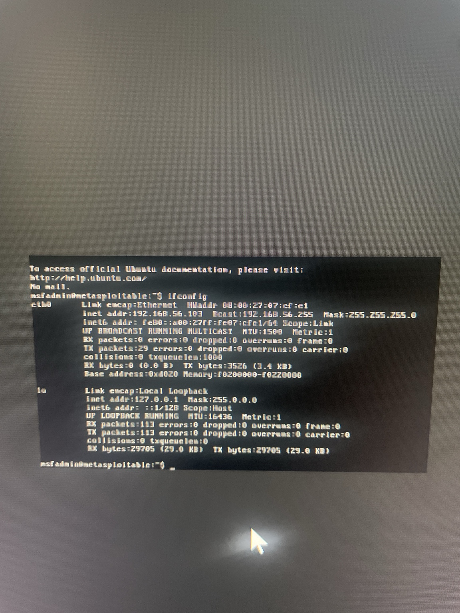
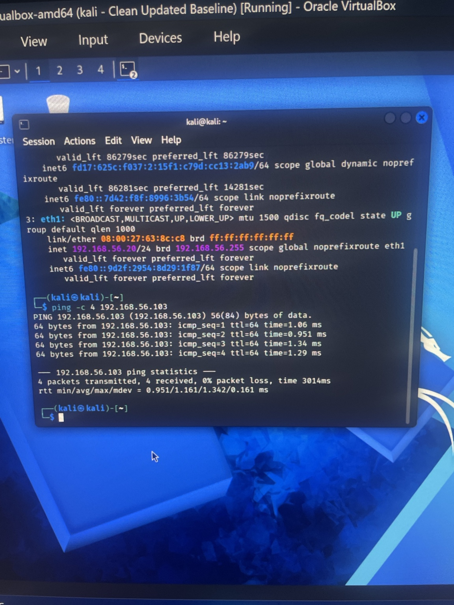
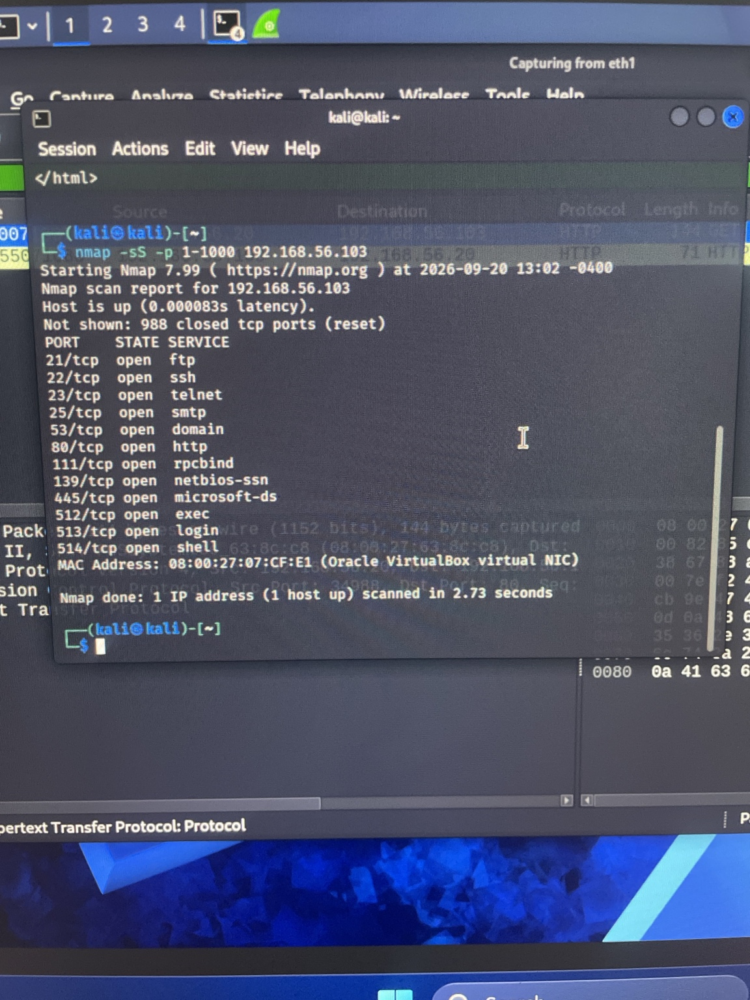
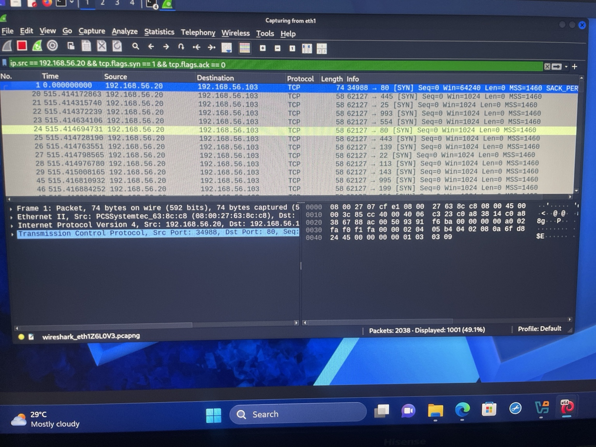
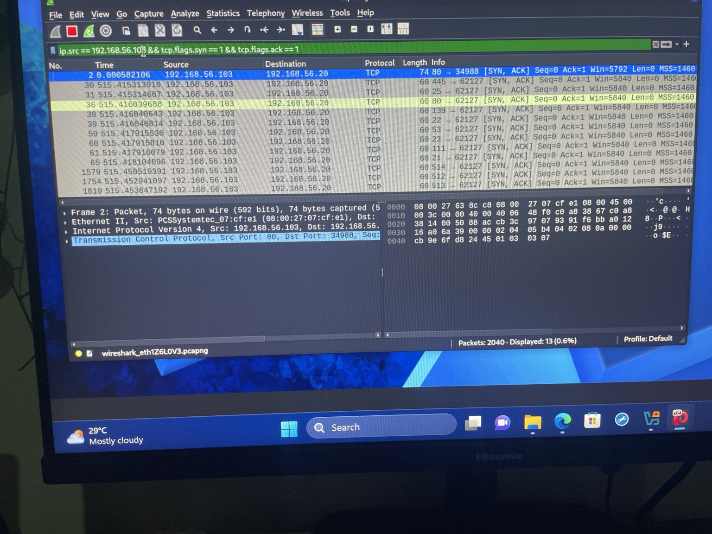
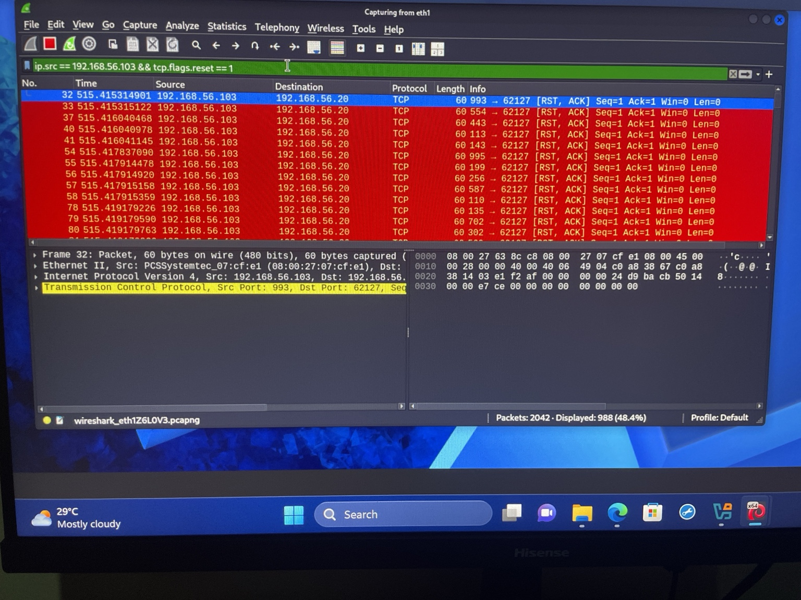
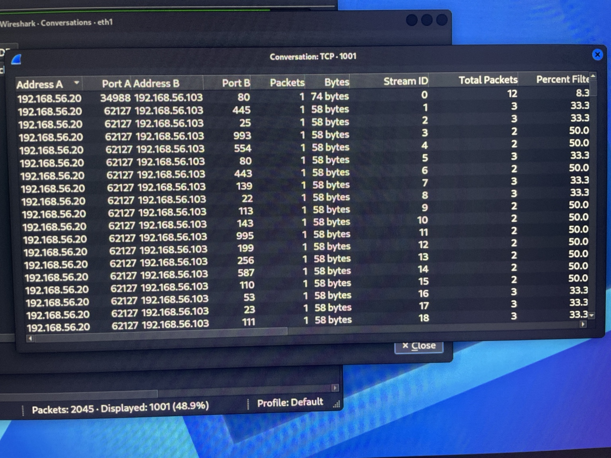
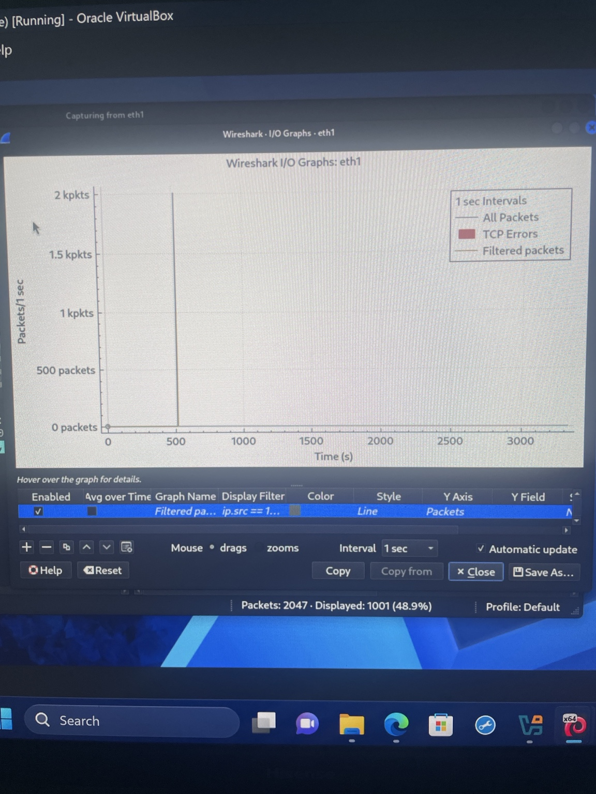
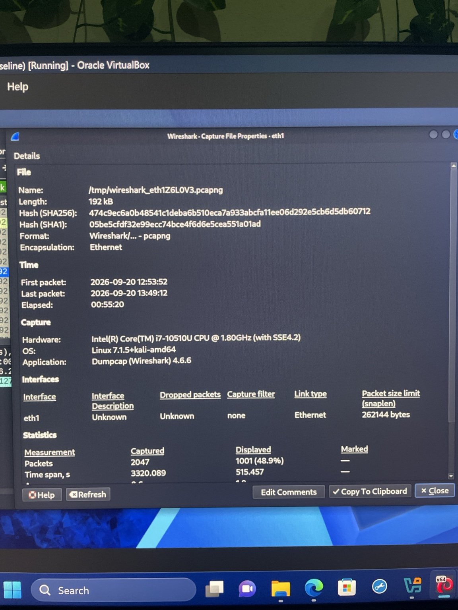

# Web Attack Detection & Investigation

## Project Overview

This project demonstrates a SOC-style investigation of suspicious web and network activity within a controlled cybersecurity lab.

Using Kali Linux as the analyst workstation and Metasploitable as the target system, I generated and captured network activity, analyzed HTTP communications, investigated TCP connection behavior, and identified network reconnaissance consistent with a SYN-based port scan.

The objective was not simply to generate traffic, but to examine the activity from a defensive analyst's perspective and determine what evidence could be used to identify suspicious behavior.

---

## Lab Environment

| Component | Purpose |
|---|---|
| Kali Linux | Analyst workstation |
| Metasploitable | Intentionally vulnerable target |
| Wireshark | Packet capture and network traffic analysis |
| Nmap | Network reconnaissance and SYN scan generation |
| VirtualBox | Isolated virtual lab environment |
| Host-only Network | Controlled communication between virtual machines |

The investigation was performed entirely within an isolated lab environment.

### Network Configuration

The Kali analyst machine was configured on the `192.168.56.0/24` host-only network. The target system used during the investigation was `192.168.56.103`.

---

## 1. Connectivity Validation

Before beginning the investigation, connectivity between the analyst workstation and target system was verified.

ICMP testing confirmed successful communication with the target, with four packets transmitted, four received, and 0% packet loss.

This established a working network baseline before additional traffic was generated.

---

## 2. HTTP Traffic Capture

Wireshark was configured to capture traffic on the host-only interface.

A basic HTTP request was generated between the systems and observed in the packet capture.

The capture showed an HTTP `GET` request from `192.168.56.20` to `192.168.56.103`, followed by an `HTTP/1.1 200 OK` response.

This confirmed that application-layer web traffic was visible to the monitoring system and established normal HTTP communication for comparison with later activity.

---

## 3. SYN Scan Generation

An Nmap SYN scan was performed against the target system to simulate network reconnaissance.

The scan identified multiple accessible TCP services, including:

- FTP — TCP/21
- SSH — TCP/22
- Telnet — TCP/23
- SMTP — TCP/25
- DNS — TCP/53
- HTTP — TCP/80
- RPC — TCP/111
- NetBIOS — TCP/139
- SMB — TCP/445
- rexec/rlogin-related services — TCP/512-514

The presence of numerous exposed services significantly increased the observable attack surface of the target.

---

## 4. Detection of SYN Scan Activity

The packet capture was filtered for TCP SYN packets originating from the analyst system:

`ip.src == 192.168.56.20 && tcp.flags.syn == 1 && tcp.flags.ack == 0`

The resulting traffic showed one source rapidly sending SYN packets to many destination ports on the same host.

From a SOC perspective, this pattern is significant because rapid connection attempts across numerous ports can indicate reconnaissance or port scanning.

---

## 5. SYN-ACK Response Analysis

Traffic from the target was then filtered for SYN-ACK responses:

`ip.src == 192.168.56.103 && tcp.flags.syn == 1 && tcp.flags.ack == 1`

Multiple services responded with `SYN, ACK` packets.

A SYN-ACK response indicates that the destination TCP port accepted the connection attempt and was listening at the time of the scan.

This packet-level evidence corroborated the open ports identified by Nmap.

---

## 6. RST Response Analysis

The investigation also examined TCP reset responses from the target:

`ip.src == 192.168.56.103 && tcp.flags.reset == 1`

Numerous `RST, ACK` responses were observed.

During this SYN scan, these responses were consistent with probes reaching TCP ports that were not accepting connections.

Comparing SYN-ACK and RST behavior allowed the scan results to be validated directly from packet-level evidence.

---

## 7. TCP Conversation Analysis

Wireshark's TCP Conversations statistics were reviewed to understand the communication pattern between the two systems.

The conversation view showed repeated interactions between `192.168.56.20` and `192.168.56.103` across many different destination ports.

Rather than normal sustained communication with a small number of services, the traffic was distributed across a broad range of ports.

This provided another indicator of systematic reconnaissance activity.

---

## 8. Traffic Pattern Analysis

Wireshark's I/O Graph was used to visualize packet activity over time.

A sharp concentration of packets was visible during the scanning period.

Traffic spikes alone do not prove malicious activity, but when correlated with the SYN pattern, multiple destination ports, and corresponding target responses, the graph provides supporting evidence of a short burst of reconnaissance activity.

---

## 9. Capture Statistics

Capture properties and statistics were reviewed as part of the investigation.

The capture contained more than 2,000 packets collected during the lab session. Filtering reduced the dataset to traffic relevant to the investigation.

This demonstrates the importance of packet filtering and traffic correlation when analyzing larger captures.

---

## Key Findings

The investigation identified several characteristics consistent with TCP port scanning:

- A single source generated connection attempts toward many TCP ports on one target.
- SYN packets were sent without the ACK flag set.
- Open services responded with SYN-ACK packets.
- Other probed ports generated TCP reset responses.
- Nmap results and Wireshark packet evidence corroborated each other.
- TCP conversation statistics showed communication distributed across numerous destination ports.
- The I/O graph showed a concentrated burst of network activity during the scanning period.

Taken together, these observations support the conclusion that the captured activity represented network reconnaissance generated by a TCP SYN scan in the lab.

---

## SOC Analyst Perspective

In a production environment, similar behavior could warrant investigation because port scanning is commonly used to identify exposed services before further activity.

An analyst should correlate this network evidence with additional telemetry such as:

- Firewall logs
- IDS/IPS alerts
- Endpoint telemetry
- Authentication logs
- Web server logs
- Threat intelligence
- Historical behavior associated with the source address

A port scan by itself does not establish that a compromise occurred. Context and additional evidence are required before determining the intent and severity of the activity.

---

## Analyst Conclusion

The investigation successfully detected and analyzed reconnaissance activity at the packet level.

By correlating Nmap scan results with Wireshark SYN packets, SYN-ACK responses, TCP resets, conversation statistics, and traffic-volume information, the activity could be reconstructed from the perspective of a security analyst.

The project demonstrates practical experience with network traffic analysis, packet filtering, reconnaissance detection, evidence correlation, and SOC-style documentation.

---

## Skills Demonstrated

`Network Traffic Analysis` • `Wireshark` • `Nmap` • `TCP/IP` • `Packet Analysis` • `Network Reconnaissance Detection` • `SOC Investigation` • `Evidence Correlation` • `Incident Documentation`

---

## Ethical Use

All activity documented in this project was performed in an isolated VirtualBox lab using intentionally vulnerable systems for educational and defensive security training purposes.
